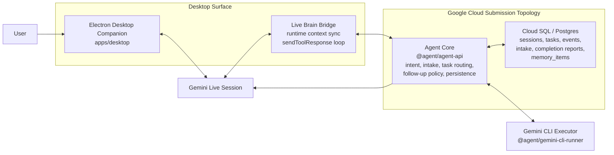

# Architecture Overview

This document explains the submission topology and shows how the current repository maps to that topology.

## Submission Topology

## Responsibility Split

### Electron desktop companion

- Presents the live companion UI
- Streams microphone audio and receives model audio output
- Forwards final transcripts and tool calls into the runtime/task layer
- Shows live message history, task status, and follow-up state

### Gemini Live session

- Handles real-time speech interaction
- Supports interruption and same-session turn continuity
- Calls a single tool, `delegate_to_gemini_cli`, when grounded local work or task follow-up is needed

### Agent core

- Resolves intent, task intake, and task routing
- Preserves canonical truth for tasks and follow-up behavior
- Converts runtime/task state into grounded briefings
- Stores sessions, task events, intake sessions, and completion reports

### Gemini CLI executor

- Performs local machine work through the `gemini` CLI
- Returns structured completion reports instead of unbounded free-form summaries
- Feeds verified results back into the runtime/task layer

### Cloud SQL / Postgres

- Persists brain sessions, messages, tasks, task events, intake sessions, and completion reports
- Provides the canonical state needed for status checks and grounded follow-up

## Current Repo Mapping

- `apps/desktop` contains the Electron companion and live bridge
- `apps/agent-api` contains the agent core modules and persistence layer
- `packages/gemini-cli-runner` contains the Gemini CLI executor adapter
- `db/migrations` contains the Postgres schema

## Important Submission Note

This repository already contains the modules that define the cloud-hosted agent core. The remaining submission gap is packaging and proof: a deployed Cloud Run service wrapper, deployment artifacts, and screenshots or URLs that show the cloud-hosted core in operation.
