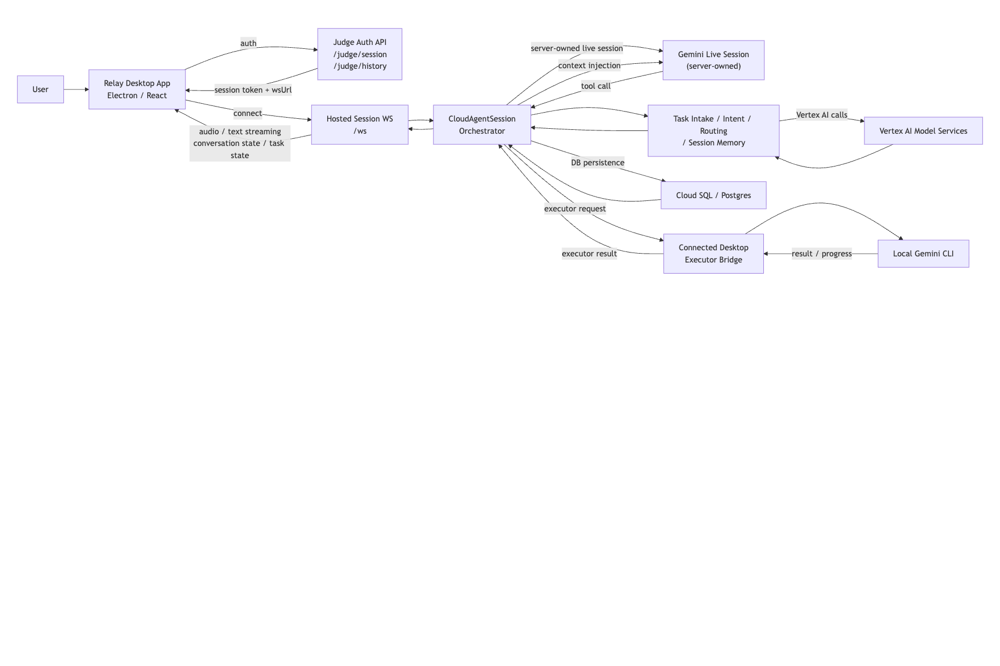

# Architecture Overview

This document reflects the current public submission architecture for Relay.

## Submission Topology

Relay keeps the live conversation, task orchestration, and canonical state in a hosted Cloud Run agent core. The desktop app is the user-facing surface, while grounded local-machine work runs only through the connected Gemini CLI executor on the user's device.

Judges use the packaged flow at [relay.leejongwoo.com](https://relay.leejongwoo.com) and receive the passcode privately through Devpost Additional Info. The public repository does not store hosted-demo credentials.

## Main Boundaries

- user device
  - `apps/desktop`
  - captures voice input, sends typed turns, plays assistant audio, and renders transcript plus task state
- hosted cloud core
  - `apps/agent-api`
  - owns the live Gemini session, task orchestration, judge auth, and canonical state
- Google AI services
  - Gemini Live for realtime voice interaction
  - Vertex AI model calls for intent, intake, routing, and session memory
- grounded local runtime
  - connected desktop executor bridge plus local `gemini` CLI worker
  - runs local file/app/browser work on the user's machine only when delegated by the hosted core

## Responsibility Split

### Relay desktop app

- Captures microphone input and plays assistant audio
- Renders the hosted conversation, task state, history, and debug surface
- Accepts the judge passcode and opens the hosted session
- Executes grounded local work through the connected `gemini` CLI worker

### Cloud Run agent core

- Owns the live Gemini session
- Owns canonical task state, follow-up policy, routing, and persistence
- Authenticates judges and issues short-lived session tokens
- Requests local execution from the connected desktop only when grounded machine work is needed
- Injects session memory and task runtime context back into the live session

### Gemini Live session

- Runs on the server side, not inside Electron
- Handles real-time speech input/output and interruption
- Uses the single `delegate_to_gemini_cli` tool for local-machine execution and task follow-up

### Cloud SQL / Postgres

- Stores sessions, conversation messages, tasks, task events, intake sessions, and typed profile memory
- Preserves canonical state across reconnects and judge sessions

### Connected desktop executor

- Runs on the judge or user machine through the local `gemini` CLI
- Performs local file/app/browser work that cannot be done purely in the cloud
- Returns structured completion reports instead of free-form success claims

## Main Flows

### Session bootstrap

- The desktop app sends the judge passcode to `/judge/session`
- The hosted core returns a short-lived session token and hosted WebSocket URL
- The desktop app connects to `/ws` and starts the hosted live session

### Realtime conversation

- The desktop app streams audio chunks and typed turns to the hosted core
- The hosted core owns the Gemini Live session and returns audio output plus transcript updates
- The hosted core persists conversation and task state in Postgres

### Grounded local execution

- Gemini Live uses the single tool path `delegate_to_gemini_cli`
- The hosted core turns that tool call into an executor request for the connected desktop
- The desktop bridge runs the local `gemini` CLI worker
- Progress events and terminal results flow back to the hosted core
- The hosted core stores those results and presents grounded summaries back through the live session

## Current Repo Mapping

- `apps/desktop`
  - Electron shell
  - hosted session client
  - local executor bridge
- `apps/agent-api`
  - Cloud Run-ready HTTP and WebSocket server
  - live session orchestration
  - task routing, intake, follow-up, and persistence
- `packages/gemini-cli-runner`
  - Gemini CLI command builder, subprocess execution, and output parsing
- `db/migrations`
  - Postgres schema for canonical state

## Submission Note

The important boundary is:

- cloud-hosted: live session, task orchestration, persistence, judge auth
- local desktop: audio surface and grounded machine execution

That is the Relay architecture you should show in the Devpost diagram and in the demo narration.
