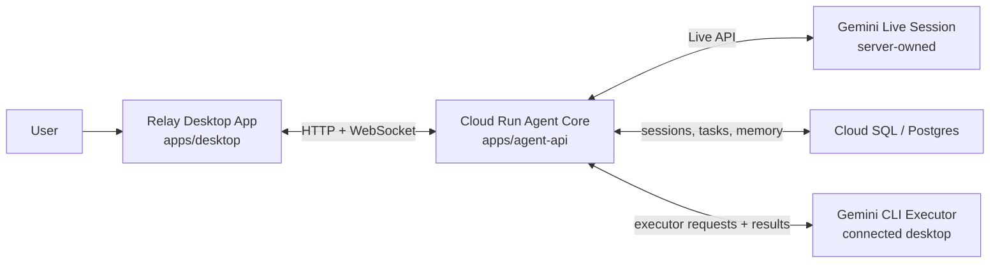

# Architecture Overview

This document reflects the current submission architecture for Relay in the repository.

## Submission Topology

## Responsibility Split

### Relay desktop app

- Captures microphone input and plays assistant audio
- Renders the hosted conversation, task state, history, and debug surface
- Accepts the judge passcode and opens the hosted session
- Executes grounded local work through the connected `gemini` CLI worker

### Cloud Run agent core

- Owns the live Gemini session
- Owns canonical task state, follow-up policy, routing, and persistence
- Authenticates judges and issues short-lived session tokens
- Requests local execution from the connected desktop only when grounded machine work is needed

### Gemini Live session

- Runs on the server side, not inside Electron
- Handles real-time speech input/output and interruption
- Uses the single `delegate_to_gemini_cli` tool for local-machine execution and task follow-up

### Cloud SQL / Postgres

- Stores sessions, conversation messages, tasks, task events, intake sessions, and typed profile memory
- Preserves canonical state across reconnects and judge sessions

### Connected desktop executor

- Runs on the judge or user machine through the local `gemini` CLI
- Performs local file/app/browser work that cannot be done purely in the cloud
- Returns structured completion reports instead of free-form success claims

## Current Repo Mapping

- `apps/desktop`
  - Electron shell
  - hosted session client
  - local executor bridge
- `apps/agent-api`
  - Cloud Run-ready HTTP and WebSocket server
  - live session orchestration
  - task routing, intake, follow-up, and persistence
- `packages/gemini-cli-runner`
  - Gemini CLI command builder, subprocess execution, and output parsing
- `db/migrations`
  - Postgres schema for canonical state

## Submission Note

The important boundary is:

- cloud-hosted: live session, task orchestration, persistence, judge auth
- local desktop: audio surface and grounded machine execution

That is the Relay architecture you should show in the Devpost diagram and in the demo narration.
